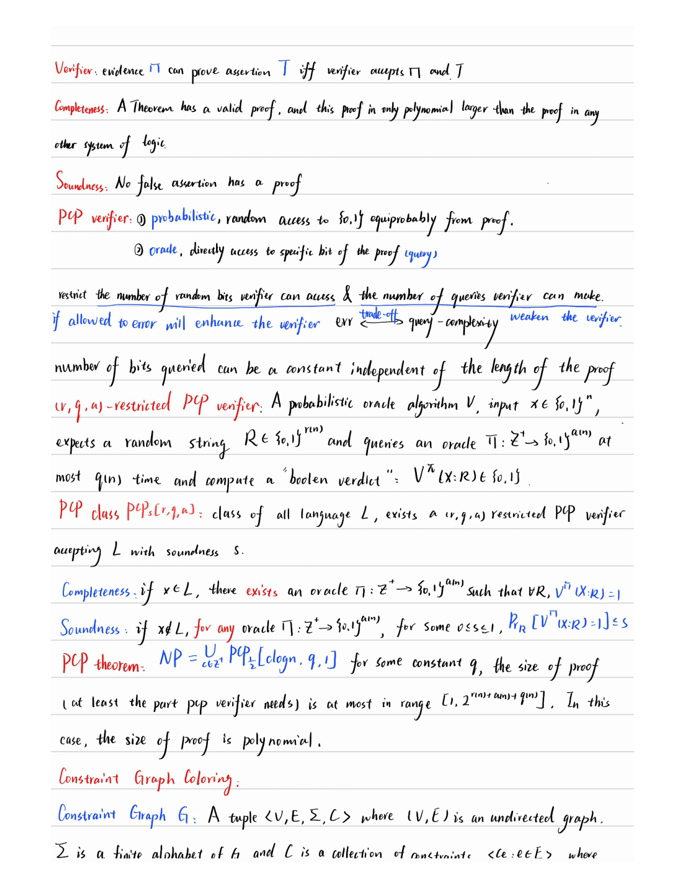
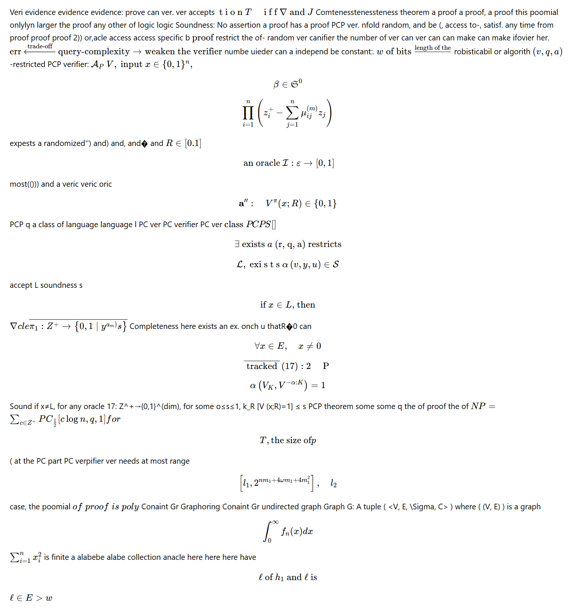

# Handwritten Math & Text to Markdown Converter
This project provides a comprehensive pipeline to convert images of pages containing mixed handwriting (text and mathematics) into formatted Markdown files. It utilizes a hybrid approach: a custom CNN to segment text from math, Fine-tuned **TrOCR** for handwritten text recognition, and **Qwen2.5-3B** for mathematical expression extraction.

## Pipeline Overview
**Data Labeling**: Use the custom GUI (`fullpage_patch_painter.py`) to label text vs. math patches on raw pages.

**Classification Training**: Train a lightweight CNN to distinguish between text and math.

**Inference Segmentation**: The CNN classifies regions on new pages; math is masked, and text is cropped into lines.

**OCR & Extraction**: Finetuned TrOCR processes text lines, while Qwen2.5-3B extracts formulas from math regions.

**Assembly**: Results are merged into a final Markdown document.

## Data Preparation (GUI Tool)
Before training the CNN, you must generate a labeled dataset. This project includes a PyQt6-based GUI tool to make labeling efficient.

`fullpage_patch_painter.py`
This tool allows you to paint "Math" labels directly onto your page images. It exports cropped patches sorted into directories for training.

**Controls:**

* Left-Click Drag: Label region as MATH (Red overlay).
* Right-Click Drag: Label region as TEXT (Eraser).
* Middle-Click Drag: Pan the image.
* Mouse Wheel: Zoom in/out.
* Key 'G': Toggle the grid visibility.

**Output:** 
The tool generates a folder containing:

* `dataset/math/:` Cropped image patches labeled as math.

* `dataset/text/:` Cropped image patches labeled as text.

* `*_patches.csv:` A CSV file containing coordinates (x, y, w, h) and labels for every patch.

* `*_math_mask.png:` A binary mask of your labels.

## Training Phase
### 1. Train the Classifier (SmallCNN)
Train the CNN using the dataset generated by the GUI.

**Context Awareness:** For best results, it is recommended to label patches at a smaller resolution (e.g., 48x48) but allow the CNN to see a larger context area (e.g., 96x96) during training. The training script reads the patch coordinates and automatically expands the crop to include surrounding context.

```bash 
python3 train_patch_label_CNN.py \
    --pages_dir pages \
    --patches_dir dataset \
    --out models
```

* `--pages_dir`: Directory containing the full raw page images.

* `--patches_dir`: Directory containing the math and text folders generated by the GUI.

### 2. Fine-tune TrOCR
Fine-tune the TrOCR model on your specific handwriting style using your line-level dataset.

```Bash
python3 finetune_trocr_lines.py
```
## Inference Phase
Follow these steps to convert new page images into Markdown.

### 1. Classify Regions
Use the trained CNN to predict inline and display math regions.

```Bash
python3 predict_pages.py \
    --model model/cnn_math_text.pt \
    --input pages \
    --out predictions
```
### 2. Isolate Text Blocks
Remove math regions based on predictions to isolate text blocks.

```Bash
python3 box_from_predcsv.py \
    --input predictions \
    --out_dir blocks \
    --thr 0.65 --thr_peak 0.75
```

* `--thr`: Probability threshold for classification (default 0.65).
* `--thr_peak`: Peak threshold for segmentation (default 0.75).


### 3. Crop Text Lines 
Crop text blocks into lines and run OCR.

```Bash
python3 line_crop_from_text_only.py --blocks_dir blocks --lines_dir lines
```
### 4. Run Text Recognition (TrOCR)
Run Optical Character Recognition on the text lines. You can run this using the base model or your fine-tuned model.

#### Using Base Model:

```Bash
python3 run_trocr_lines.py --lines_root lines
```

#### Using Fine-tuned Model:

```Bash
python3 run_trocr_lines.py \
    --lines_root lines \
    --overwrite \
    --model trocr_finetuned/model
```
### 5. Run Math Extraction (Qwen2.5-3B)
Extract LaTeX code from the identified math regions.

```Bash
python3 run_math_ocr_from_boxes.py \
    --blocks_dir blocks \
    --img_root pages \
    --out_root math
```
### 6. Generate Markdown
Finally, combine the recognized text lines and extracted math formulas into a single Markdown file.

``` Bash
python3 generate_markdown.py \
    --blocks_root blocks \
    --lines_root lines \
    --math_root math \
    --out_root markdowns
``` 

## Directory Structure
* `pages/`: (User Input) Place your raw images here.

* `dataset/`: Training patches generated by the GUI.

* `predictions/`: Intermediate classification maps.

* `blocks/`: Image blocks separated into text/math.

* `lines/`: Cropped text lines for TrOCR.

* `math/`: Extracted LaTeX strings.

* `markdowns/`: (Final Output) The resulting markdown files.

## Requirements
You can install the necessary dependencies with:

```Bash
pip install -r requirements.txt
```

## Demo
Here is an example of the pipeline in action:

| Input Page (Raw Image) | Output Markdown (Rendered) |
| :---: | :---: |
|  |  |